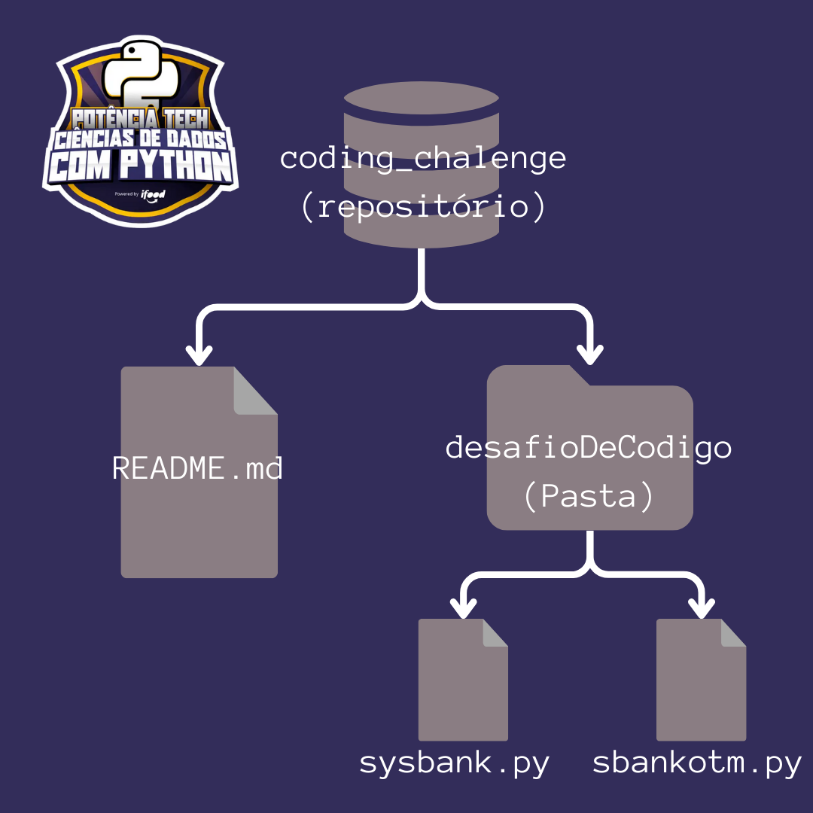

# 💻 Desafio de Código DIO - Potência Tech powered by iFood | Ciências de Dados com Python

  O repositório *coding_chalenge* contém os arquivos .py que representam o código desenvolvido durante as aulas do Bootcamp de Ciência de Dados em Python, um desafio proposto pela plataforma **[DIO](https://www.dio.me/)** (Digital Innovation One). O objetivo desse desafio é desenvolver um Sistema Bancário Simples, com as seguintes operações: sacar, depositar e extratos. Além disso, esse desafio será para aplicar os conceitos e técnicas aprendidos ao longo do curso, demonstrando habilidades em programação em Python.

---

## 💾 Como está organizado este repositório?

